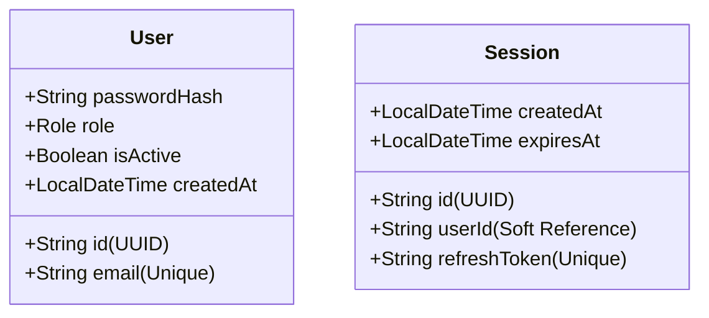

# 🔐 clinic-identity — Dịch vụ Xác thực & Phân quyền (Utility Service)

## 📋 1. Giới thiệu chung

`clinic-identity` là một **Utility Service** cốt lõi đóng vai trò là **Trung tâm Auth (Authentication & Authorization Hub)** của toàn bộ Hệ thống Đặt Lịch Khám Bệnh (kiến trúc SOA - Microservices). Dịch vụ chịu trách nhiệm tối cao trong việc bảo vệ hệ thống, quản lý tài khoản người dùng, cấp phát mã xác thực an toàn và kiểm soát phiên làm việc (Session) của các đối tượng tham gia hệ thống bao gồm Bệnh nhân, Bác sĩ và Quản trị viên.

---

## 🎯 2. Chức năng chính (theo Thiết kế SOA)

- **Đăng ký tài khoản (`Register`)**: Hỗ trợ đăng ký tài khoản mới cho Bệnh nhân, tự động mã hóa mật khẩu trước khi lưu xuống cơ sở dữ liệu.
- **Đăng nhập (`Login`)**: Kiểm tra thông tin đăng nhập, cấp phát Access Token ngắn hạn và sinh Refresh Token dài hạn.
- **Cơ chế Cookie bảo mật**: Lưu trữ `refresh_token` ở phía client thông qua Secure HttpOnly Cookie để chống các cuộc tấn công XSS.
- **Tự động ghi đè Session**: Quản lý phiên làm việc tập trung trong DB, tự động dọn dẹp và ghi đè session cũ của người dùng khi có phiên đăng nhập mới.
- **Đăng xuất (`Logout`)**: Thu hồi phiên làm việc, xóa bỏ Refresh Token khỏi cơ sở dữ liệu và xóa Cookie phía Client.
- **Làm mới Token (`Refresh`)**: Xác thực Refresh Token còn hiệu lực và cấp phát `accessToken` mới mà không cần đăng nhập lại (Token Rotation được cấu hình giữ nguyên refresh token cũ).
- **Xác thực Token tập trung (`Validate`)**: Cung cấp API xác thực nhanh JWT cho các dịch vụ khác (qua Feign Client hoặc API Gateway) kiểm chứng.

---

## 🛠️ 3. Tech Stack đặc thù

- **Framework**: Spring Boot 3.3.x, Spring Security (Stateless Session)
- **Database**: MySQL 8.x (Production) & **H2 In-Memory Database** (dành riêng cho môi trường Test độc lập)
- **ORM**: Spring Data JPA & Hibernate
- **Mã hóa**: BCrypt Password Encoder
- **Token Standard**: JSON Web Token (JWT) thông qua thư viện `io.jsonwebtoken (jjwt)` phiên bản `0.12.6`
- **Công cụ bổ trợ**: Lombok (Tự sinh boilerplate code)
- **Test**: JUnit 5, Mockito, Spring Boot Test, MockMvc (đạt độ phủ 100% các lớp nghiệp vụ chính)

---

## 📁 4. Package Structure (Đúng chuẩn Backend Rules)

Dịch vụ được cấu trúc chặt chẽ theo mô hình chuẩn hóa của dự án:

```directory
com.ducnguyen.clinic_identity
├── config                      # Cấu hình Spring Security, PasswordEncoder...
├── controller                  # Lớp tiếp nhận HTTP Requests (REST API Endpoints)
├── dto                         # Data Transfer Objects
│   ├── request                 # DTO nhận dữ liệu đầu vào (AuthRequest, RegisterRequest)
│   └── response                # DTO trả dữ liệu ra (AuthResponse, LoginResult)
├── entity                      # Các thực thể ánh xạ xuống JPA database (User, Session)
├── enums                       # Khai báo các hằng số phân quyền (Role: PATIENT, DOCTOR, ADMIN)
├── exception                   # Xử lý ngoại lệ tập trung (@ControllerAdvice, CustomException)
├── repository                  # Lớp giao tiếp DB (UserRepository, SessionRepository)
├── service                     # Interface và Lớp thực thi logic nghiệp vụ (AuthService)
│   └── impl
└── utils                       # Các công cụ tiện ích phụ trợ (JwtUtils xử lý JWT)
```

---

## 🚀 5. Danh sách API Endpoints quan trọng

Toàn bộ các API đều trả về response thống nhất theo định dạng chuẩn `ApiResponse<T>` và được phiên bản hóa qua tiền tố `/api/v1/auth/...`

| Method   | Endpoint                | Quyền truy cập | Mô tả                                  | Tham số đầu vào              | Response Body chuẩn                              |
| :------- | :---------------------- | :------------- | :------------------------------------- | :--------------------------- | :----------------------------------------------- |
| **POST** | `/api/v1/auth/register` | Public         | Đăng ký tài khoản Bệnh nhân mới        | `RegisterRequest` (JSON)     | `ApiResponse<Void>`                              |
| **POST** | `/api/v1/auth/login`    | Public         | Đăng nhập, trả về token & set cookie   | `AuthRequest` (JSON)         | `ApiResponse<AuthResponse>` _(Chứa AccessToken)_ |
| **POST** | `/api/v1/auth/logout`   | Public         | Đăng xuất, xóa session & hủy cookie    | Lấy từ `CookieValue`         | `ApiResponse<Void>`                              |
| **POST** | `/api/v1/auth/refresh`  | Public         | Đổi Refresh Token lấy Access Token mới | Lấy từ `CookieValue`         | `ApiResponse<AuthResponse>` _(AccessToken mới)_  |
| **POST** | `/api/v1/auth/validate` | Hệ thống       | Xác thực tính hợp lệ của Access Token  | `@RequestParam String token` | `ApiResponse<Boolean>`                           |

---

## 💾 6. Thực thể Cơ sở dữ liệu (Entities)

Áp dụng nguyên tắc **Database per Service** và **Liên kết mềm (Soft References)** qua ID để tối ưu tính tự trị của dịch vụ.



<<<<<<< HEAD
- **User Entity**: Lưu trữ thông tin tài khoản cơ bản. Không lưu thông tin chi tiết (Hồ sơ chi tiết của Bác sĩ và Bệnh nhân sẽ do `clinic_profile` quản lý).
=======
- **User Entity**: Lưu trữ thông tin tài khoản cơ bản. Không lưu thông tin chi tiết (Hồ sơ chi tiết của Bác sĩ và Bệnh nhân sẽ do `clinic-profile` quản lý).
>>>>>>> 63ae043 (khoa)
- **Session Entity**: Lưu trữ Refresh Token đang hoạt động. Khi người dùng đăng nhập lại, hệ thống sẽ thực hiện thao tác xóa session cũ của `userId` đó và lưu session mới nhằm hỗ trợ cơ chế ghi đè thông minh.

---

## 🔗 7. Tương tác với các Dịch vụ khác (Inter-service Communication)

- **Với Client / API Gateway**: Cung cấp Access Token ngắn hạn cho Client để đính kèm vào Header `Authorization: Bearer <Token>` khi gọi các dịch vụ nội bộ khác.
<<<<<<< HEAD
- **Với các Dịch vụ nội bộ (`clinic_profile`, `clinic_appointment`, v.v.)**: Các dịch vụ này sẽ gọi API `/api/v1/auth/validate` của `clinic-identity` (ưu tiên gọi thông qua **Feign Client** được cấu hình bảo mật ở API Gateway) để kiểm tra tính hợp lệ của mã thông báo trước khi xử lý nghiệp vụ.
=======
- **Với các Dịch vụ nội bộ (`clinic-profile`, `clinic-appointment`, v.v.)**: Các dịch vụ này sẽ gọi API `/api/v1/auth/validate` của `clinic-identity` (ưu tiên gọi thông qua **Feign Client** được cấu hình bảo mật ở API Gateway) để kiểm tra tính hợp lệ của mã thông báo trước khi xử lý nghiệp vụ.
>>>>>>> 63ae043 (khoa)

---

## 📌 8. Lưu ý quan trọng & Design Patterns áp dụng

- **Builder Pattern**: Được áp dụng triệt để tại `JwtUtils` để xây dựng cấu trúc các JWT Token phức tạp (chứa Subject, Expiration, các Custom Claims như ID, Role) một cách tường minh và linh hoạt.
- **Nguyên tắc Loose Coupling**: Không chứa bất kỳ liên kết khóa ngoại (Foreign Key) cứng nào đến các bảng của service khác. Liên kết tới Patient hay Doctor đều qua `userId` dạng String (Soft Reference).
- **Bảo mật Cookies**: Cookie chứa `refresh_token` bắt buộc phải có cờ `HttpOnly` và `Secure`, ngăn chặn tối đa việc đánh cắp token thông qua mã độc Javascript chạy ở Client.

---

## 🏃‍♂️ 9. Hướng dẫn chạy Service

### 🔑 Yêu cầu hệ thống

- Cài đặt sẵn **Java SDK 21**.
- Cơ sở dữ liệu **MySQL** đang hoạt động (đã khởi tạo sẵn database `clinic_identity`).

### ⚙️ Cấu hình môi trường

Mở file [application.yml](file:///c:/Users/DUC/Desktop/BookingClinic/backend/clinic-identity/src/main/resources/application.yml) và cấu hình các thông số kết nối Database cũng như Secret Key cho JWT:

```yaml
spring:
  datasource:
    url: jdbc:mysql://localhost:3306/clinic_identity?useSSL=false
    username: <YOUR_MYSQL_USERNAME>
    password: <YOUR_MYSQL_PASSWORD>
jwt:
  secret: <MÃ_HEX_SECRET_KEY_CỦA_BẠN>
  expirationMs: 3600000 # 1 giờ (Access Token)
  refreshExpirationMs: 2592000000 # 30 ngày (Refresh Token)
```

### 🛠️ Các lệnh vận hành chính

Di chuyển vào thư mục `backend/clinic-identity` và sử dụng các lệnh Maven Wrapper sau:

1. **Biên dịch dự án**:
   ```powershell
   .\mvnw.cmd clean compile
   ```
2. **Chạy toàn bộ Test Suite (H2 Database chạy ngầm)**:
   ```powershell
   .\mvnw.cmd test
   ```
3. **Khởi chạy ứng dụng Spring Boot**:
   ```powershell
   .\mvnw.cmd spring-boot:run
   ```
